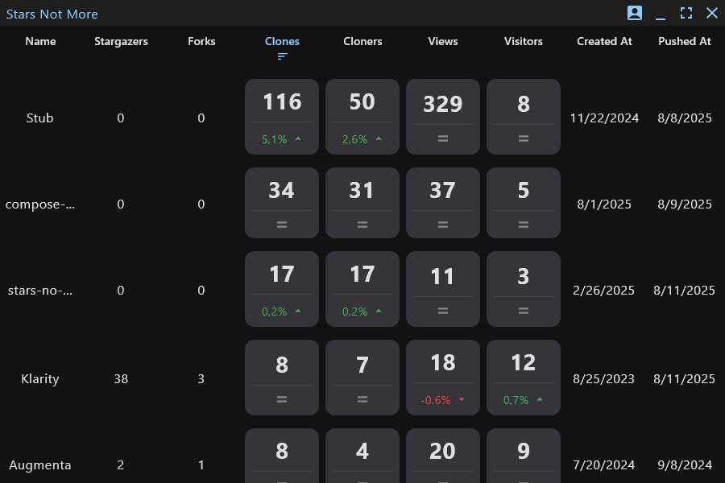

# Stars No More

An application for getting a summary of statistics and traffic of a user's GitHub repositories

> The application was designed using the [Reduce & Conquer](https://github.com/numq/reduce-and-conquer) architectural
> pattern

## Usage

> [!NOTE]
> Data is only available for repositories of type `owner`

- Clone the repository
- Build the project
- Create a GitHub token with read-only access to public repositories
- Use credentials via in-app input or in a credentials.json file in the following format:
  `{"name":"name","token":"token"}`

## Features

- Dashboard with information about the last 30 pushed repositories
- Information about traffic growth over the last two weeks (last week relative to the penultimate)
- Right-click to open the context menu and refresh the dashboard
- Sorting by criteria: `name`, `stargazers`, `forks`, `clones`, `cloners`, `views`, `visitors`